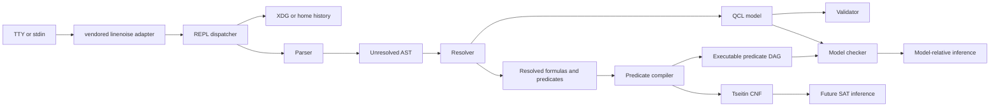
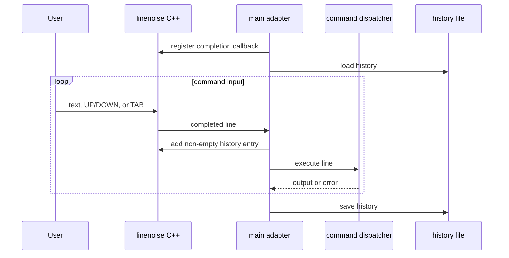
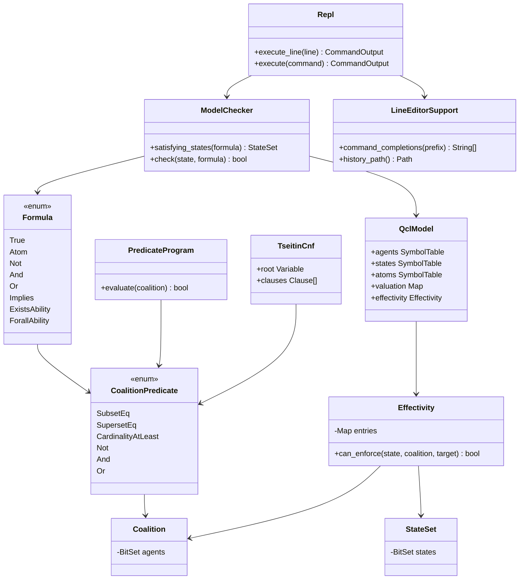

# UML

## Components

```mermaid
flowchart LR
    Terminal[TTY or stdin] --> Linenoise[vendored linenoise adapter]
    Linenoise --> REPL[REPL dispatcher]
    REPL --> History[XDG or home history]
    REPL --> Parser
    Parser --> Raw[Unresolved AST]
    Raw --> Resolver
    Resolver --> AST[Resolved formulas and predicates]
    Resolver --> Model[QCL model]
    AST --> Compiler[Predicate compiler]
    Compiler --> DAG[Executable predicate DAG]
    Compiler --> CNF[Tseitin CNF]
    Model --> Validator
    Model --> Checker[Model checker]
    DAG --> Checker
    Checker --> Inference[Model-relative inference]
    CNF --> Future[Future SAT inference]
```

Interactive ownership:

```mermaid
sequenceDiagram
    participant User
    participant Native as linenoise C++
    participant Main as main adapter
    participant Repl as command dispatcher
    participant Disk as history file
    Main->>Native: register completion callback
    Main->>Disk: load history
    loop command input
        User->>Native: text, UP/DOWN, or TAB
        Native->>Main: completed line
        Main->>Native: add non-empty history entry
        Main->>Repl: execute line
        Repl-->>Main: output or error
    end
    Main->>Disk: save history
```

## Core types

```mermaid
classDiagram
    class Coalition {
      -BitSet agents
    }
    class StateSet {
      -BitSet states
    }
    class CoalitionPredicate {
      <<enum>>
      SubsetEq
      SupersetEq
      CardinalityAtLeast
      Not
      And
      Or
    }
    class Formula {
      <<enum>>
      True
      Atom
      Not
      And
      Or
      Implies
      ExistsAbility
      ForallAbility
    }
    class Effectivity {
      -Map entries
      +can_enforce(state, coalition, target) bool
    }
    class QclModel {
      +agents SymbolTable
      +states SymbolTable
      +atoms SymbolTable
      +valuation Map
      +effectivity Effectivity
    }
    class PredicateProgram {
      +evaluate(coalition) bool
    }
    class TseitinCnf {
      +root Variable
      +clauses Clause[]
    }
    class ModelChecker {
      +satisfying_states(formula) StateSet
      +check(state, formula) bool
    }
    class Repl {
      +execute_line(line) CommandOutput
      +execute(command) CommandOutput
    }
    class LineEditorSupport {
      +command_completions(prefix) String[]
      +history_path() Path
    }

    CoalitionPredicate --> Coalition
    Formula --> CoalitionPredicate
    Effectivity --> Coalition
    Effectivity --> StateSet
    QclModel --> Effectivity
    PredicateProgram --> CoalitionPredicate
    TseitinCnf --> CoalitionPredicate
    ModelChecker --> QclModel
    ModelChecker --> Formula
    Repl --> ModelChecker
    Repl --> LineEditorSupport
```
